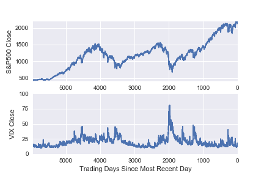

# Machine Learning Engineer Nanodegree

## Capstone Project

Rui Maranhao  
June 8th, 2017

## I. Definition

### Project Overview

Regarding it as a stochastic process, on any given day, there is approximately
a 50% chance that the stock market will increase and a 50% chance that the
stock market will decrease. If a trader is able to predict the moving direction
of the market with a probability significantly greater than 50%, then there will
be a significant competitive advantage.

There are several indices for monitoring the performance of the US stock market.
In this project, we will use the the S&P500 index, which measures the performance
of the stock prices of 500 of the largest publicly traded companies, and the
CBOE's Volatility Index, known by its ticker symbol VIX, which a popular measure
of the implied volatility of S&P 500 index options, calculated and published by
the Chicago Board Options Exchange (CBOE).

Historical data for the S&P500 is widely available. For this project, over 23
years of historical S&P500 [1] and Vix [2] data was downloaded from Yahoo!
Finance.

### Problem Statement

A trader that is able to predict the direction of the market has a competitive
advantage over the other traders that use common sense and intuition (or, should
we rather say, random guesses).

The objective of this project is to determine whether machine learning techniques
can be used to predict the directionality (i.e. **up** or **down**) of the S&P500
stock market index on any given day, based on the market opening price and an
assortment of historical market data.

In the context of this project, we are framing this challenge as a classification
problem where directionality is defined as a ‘1’ for an increase in market
value and as a ‘0’ for a decrease in market value. The directionality is defined
relative to the opening value.

We will apply several supervised learning classification techniques, namely
Decision Tree, Gaussian NB, SVM, Random Forests, and neural networks. Briefly,
the methodology is as follows: using market price, market volume and market
volatility data, various data features will be ‘engineered’. These features
will primarily focus on relative returns and relative differences between the
trading days, across various data columns. Using these features, a classifier
will be trained and optimized to predict the label for any given day, where
the label is a ‘1’ if the market is predicted to close higher that day and a
‘0’ otherwise.

### Metrics

The stock market has historically increased slightly more than it has decreased
(roughly 54% of days are increases). Therefore, rather than randomly choosing
up or down as the benchmark, with a 50% probability of either, a more suitable
benchmark is always predicting an increase (i.e. always choose a directionality
of ‘1’), since this will typically be correct 54% of the time.

The accuracy of the machine’s predictions will be compared to the accuracy of
the benchmark case. Accuracy is defined as follows:

>Accuracy = (True Positives + True Negatives) / Total Population

In addition, the F1 Score of the benchmark and the model will be compared,
since F1 provides the added insight of precision and recall. The F1 Score
is defined as follows:

>F1 = 2 x (Precision x Recall) / (Precision + Recall)

where

>Precision = True Positives / (True Positives + False Positives)

>Recall = True Positives / (True Positives + False Negatives)

As a final metric for assessing the models, the classifier will be used to make
stock trading predictions, to determine whether any increase in accuracy versus
the benchmark can be exploited for trading profit. Specifically, the daily
profit from the benchmark and the machine learner will be tallied to generate a
cumulative profit over the test period, allowing one to assess whether the
recommendations of the model can be converted into a useful trading strategy.
Since the ultimate objective of a stock trader is to make profitable trades,
using cumulative profit is a justified metric to convert accuracy results into
trading performance.

## II. Analysis

### Data Exploration

The data used in this project is historical market data from January 29th, 1993
to September 29th, 2016 (at the time of writing, the python libs to access Yahoo
Finance data no longer work...). The start date was chosen based on this date
being the earliest date for which volatility (VIX) data was available via
Yahoo! Finance.

The raw data is included in the ‘SP500_historical.csv’ file provided as part of
the project submission. The raw data file contained 10 fields:

The 10 raw data fields are as follows:
- Date: calendar date for any given data row
- SP_Open: opening value (recorded at 9:30ET) for the S&P500
- SP_High: highest value on any given day for the S&P500
- SP_Low: lowest value on any given day for the S&P500
- SP_Close: closing value (recorded at 16:00ET) for the S&P500
- SP_Volume: number of shares of S&P500 components traded
- Vix_Open: opening value for the VIX index
- Vix_High: highest value on any given day for the VIX index
- Vix_Low: lowest value on any given day for the VIX index
- Vix_Close: closing value for the VIX index

#### Exploratory Visualization

We have collected information for 5,962 trading days. Figure 1 presents
a plot of the S&P500 and VIX closing value for each of these days.

The S&P500 has generated considerable up and down movement over the 23 years, but
has an upwards looking general trend. Given that there is significant range in
values, the data oughts to be normalized prior to machine learning analyses, so
that relative data can be used to identify relevant trends across such a wide
time range.

In contrast, the VIX index does not generally trend upwards. As said before, it
indicates the level of volatility in the market, and thus can spike and then
subside. For example, the massive spike in the VIX from around 2,000 trading
days ago corresponds to the ‘Great Recession’ of 2008.

The trends seen for the other S&P500 and VIX related data (opening, high and
low values for each) are very similar to those shown in the plots. The only
other data in the raw data file is the S&P500 trading volume per day, as shown
in Figure 2.

The S&P500 trading volume has generally trended up with time, although it peaked around the time of the ‘Great Recession’ and appears to have come down and stabilized since then.
Given the properties of the raw data, normalization steps will be used for transforming all of the data to percentage changes relative to other days, as will be discussed in detail in the Methodology portion of this report. This type of normalization is required given the huge differences in absolute values for each of these data sets over the 20+ years under consideration here. In addition to normalization, new features will be ‘engineered’, based on various calculations conducted on the raw data set, ultimately arriving at 20 features for the machine learning algorithms.

### Algorithms and Techniques

Five supervised learning techniques were applied in this project:
- Decision Trees (DT)
- Naïve Bayes (NB)
- Support Vector Machines(SVM)
- Random Forests (RF)
- Neural Network (NN)

The first four techniques are available in the Python scikit-learn (sklearn)
module. The NN was built using TensorFlow. Next we will motivate the usage of
these techniques and give further details about the techniques.

These four approaches were chosen since, except Decision Trees and Random Forests,
they are significantly different from each other. I had the need to try different
techniques because my quest was to find the best performing one in this context.
The amount of data available also played an important role in deciding to try
these techniques out.

###### Decision Trees (DT)

Decision trees are a logic-based algorithm and are generally applicable to
problems with discrete or categorical features, since the tree structure is
based on learning simple decision rules from the features. Strengths of DTs
are the speed of training and classification, relatively high tolerance to
missing or irrelevant attributes and the relative ease with which the model
and the model parameters can be understood and interpreted. Weaknesses of
DTs include relatively low accuracies compared to other models, a tendency
to overfit and the possibility of instability, since small variations in
the data might result in a completely different tree being generated.

###### Naïve Bayes (NB)

Naive Bayes is a probabilistic based algorithm and has proven to be generally
applicable to document classification and spam filtering problems. Strengths
of NBs are that they require relatively small data sets and are extremely
fast learners and classifiers. Like DTs, they are also relatively easy to
understand and interpret, especially for people accustomed to thinking in terms
of probabilities. Weaknesses include low accuracy in broader applications
(i.e. beyond document classification) and low tolerance to highly interdependent
attributes.

###### Support Vector Machines(SVM)

Support vector machines are generally applicable to learning problems with
continuous attributes (not discrete ones). Strengths of SVM include relatively
high accuracy and a high tolerance to irrelevant, redundant or interdependent
attributes. Weaknesses of SVM include the requirement for large data sets,
slow learning speed, risk of overfitting and models that lack intuitive
understanding, making them hard to understand, interpret or explain to others
(i.e. they are very "black box" in nature).

###### Random Forests (RF)

The main disadvantage of DTs is that they can overfit. And that is where ensemble
methods like random forests (or boosted trees) come in for the rescue. Plus,
random forests are often the winner for lots of problems in classification
(usually slightly ahead of SVMs, I believe), they're fast and scalable, and one
does not have to worry about tuning a bunch of parameters like you do with SVMs,
so they seem to be quite popular these days.

###### Neural Network (NN)

Neural networks are a powerful technique based on the workings of brain
neurons. Their advantages include impressive results in many domains
and also broad applicability. The disadvantages include their ‘black box’
nature, making it difficult to determine the impact of individual features,
the large amount of data often needed, the large number of hyper parameters
requiring tuning and also the significant run time often required to achieve
good results.

### Benchmark

Over the 252 trading days (roughly one year), which serves as the test set for
the classifiers, the S&P500 closed higher on approximately 53% of the days.
Therefore, the most reasonable prediction for any given day would be that the
market would increase. If the model were to make this prediction on the test
set used, it would have an accuracy of 53% and an F1 score of 0.69. These
values are used as the benchmark.

For futher information on how to compute these values, refer to the accompanying
IPython notebook.

## III. Methodology

### Data Preprocessing

A significant amount of data processing and feature engineering was carried out
on the raw data set, to transform the 10 data info into one label and 21 features.
There were several reasons for these transformations. First, as discussed previously
using absolute values for the various data fields would likely not be productive,
given how much the S&P500 index has grown (over 5X) in the 23 years worth of data
considered. Therefore, fields needed to be turned into relative values (e.g.
relative returns, relative volumes) to make it possible to compare data points
on the same page.

Second, a fair amount of domain knowledge is needed to be built into the models.
I have spoken with several friends that are on the finance domain about predictive
features of stock movements. The one label that was calculated for the project
was called ‘Intraday_Increase’. ‘Intraday_Increase’ takes on the value of ‘1’ if
the S&P500 closed higher than it opened on any given day and ‘0’ if it closed at
or below the opening value. This is determined by taking ‘SP_Close’ minus
‘SP_Open’ and assigning a ‘1’ if the value is positive and a ‘0’ otherwise.
The objective of the machine-learning algorithm is to predict **this label**.

The 21 features that were calculated are:

- Days_Since_Open: a measure of how many days it has been since the market was last open. On a regular week, Tuesday, Wednesday, Thursday and Friday will have a value of ‘1’ whereas Monday will have a value of ‘3’. A day following an intraweek holiday should have a value of ‘2’ and a Monday or Tuesday following a long weekend should have a value of ‘4’. In rare circumstances (e.g. following the September 11, 2001 terrorist attacks) the market could be closed for even longer and this duration will be reflected in ‘Days_Since_Open’. ‘Days_Since_Open’ was calculated by subtracting the dates between two adjacent rows. The rationale for including this feature is that the markets might behave differently depending on whether traders have had a long break to digest news. Also, market moving information is routinely released over weekends (e.g. very large mergers, government bailouts etc.).

- Break_Coming: a Boolean measure of whether or not a weekend or holiday is approaching. On a regular week, Monday, Thursday will have a value of ‘0’ whereas Friday will have a value of ‘1’. On a holiday week (e.g. Thanksgiving Thursday), a regular weekday (Wednesday in this example) should have a value of ‘1’. ‘Break_Coming’ values were derived by shifting ‘Days_Since_Open’ by one row and looking for instances where ‘Days_Since_Open’ values exceeded ‘1’, since these indicate weekends or holidays. The rationale for including this feature is that traders’ moods and outlook are possibly dependent on pending breaks.

- Overnight_Return: a measure of the percentage return when comparing ‘SP_Open’ of day n to ‘SP_Close’ of day n-1. It represents whether the market has opened higher (if ‘Overnight_Return’ is positive) or lower than the previous close. Since the opening price (SP_Open) is the last and most recent piece of data that the machine will have prior to having to predict whether the market will move up or down from there, using it in various features is critical.

- Overnight_VIX: same as before but for the VIX Index instead of the S&P500 Index. An increase in the VIX overnight might be taken as indication that the market will be more volatile that day.

- O2O: a measure of the percentage return when comparing ‘SP_Open’ of day n to ‘SP_Open’ of day n-1. It represents whether the market has opened higher (if is positive) or lower than the previous day’s open. A positive ‘O2O’ value could indicate market optimism and resilience and provides yet another opportunity to incorporate the crucial ‘SP_Open’ value into a feature.

- 1d_Ret to 252d_Ret: These are all trailing return indicators. For example, ‘1d_Ret’ measures the market return for trading day n-1 compared to trading day n-2, by calculating the percentage change in ‘SP_Close’ between the two days. This provides a very short-term indication of how the market has performed on the most recent historical day. Similar calculations were done looking back 2, 3, 4, 5, 21 (1 month), 63 (3 months), 126 (half year), 189 (9 months), and 252 (year) trading days. By including a wide range of trailing returns, the classifier can gain insight into a wide range of recent market performance, from the very short-term to the fairly long-term.

- 1d_VIX and 5d_VIX: derived by using ‘Vix_Close’ values and performing the same type of trailing return calculations as described above for the S&P500 index. These two features measure whether market volatility is trending up or down in the very short-term and short-term.

- 1d_Rel_Vol: a measure of whether the most recently available volume data (i.e. the data from day n-1) is above or below average compared to the previous four days before it. It takes the day n-1 volume, divides it by the rolling average of the 4 days prior (days n-2 through n-5), and then subtracts 1 from the result. Thus, if the value is above zero, the most recent day has relatively high volume compared to the prior 4 days. The rationale for including this feature is that it seems important for the machine learning algorithm to know whether trading volume on the most recent day was relatively heavy, relatively unchanged or relatively light compared to the previous four days.

- 5d_Rel_Vol: similar measure to ‘1d_Rel_Vol’ but it looks at volume data over a longer period. It takes the rolling average of the previous 5 days of volume data and compares it to the rolling average of the 21 days prior to those 5 days. In other words, it is effectively determining whether the most recent week of trading volume is heavy compared to the prior month (since a typical trading week is 5 days and a typical month is 21 days). This feature could be an important indicator of whether the market is experiencing a busy or quiet period, and hence a useful feature in predicting movements.

- 1d_PtT:  the only feature that makes use of the ‘SP_High’ and ‘SP_Low’ data in the raw data file. ‘PtT’ stands for peak to trough. This feature is an indicator of how much the previous trading day moved from its peak (‘P’) to its trough (‘T’). To derive this value, one takes the previous day’s high value (‘SP_High’) and subtracts the previous day’s low value (‘SP_Low’) and then divides the result the average opening and closing prices (‘SP_Open’ and ‘SP_Close’). On days where the difference between peak and trough are small, this feature will approach zero, but on days with significant differences between the peak and trough, this value could be well above zero. The rationale for including this feature is that it allows the machine learner to know whether the previous trading day experienced significant swings in market value or not.

- 1d_VIX_PtT: performs an identical calculation to that discussed for ‘1d_PtT’ except that VIX raw data is used instead of S&P500 data.

After the feature engineering step, several rows of data needed to be discussed. First, any row with a ‘nan’ value was discarded. These ‘nan’ values were an expected outcome of the feature-engineering step. Specifically, the 252-day trailing return calculation could not be properly done on the first 253 data points, since there were no historical data on which to base the calculations. So, this was discarded, yielding a data set consisting of 5,709 rows.

Second, it was observed that for a large number of the older data points (those points past approximately 8 years ago), the ‘SP_Open’ value on day n was identical to the ‘SP_Close’ value on day n-1. Since the probability of the S&P500 opening on any given day at a value exactly equal to the former day’s close is essentially zero, this data was considered unreliable. It is possible that the previous close was simply being pasted in as the new open for a large chunk of the data, due to a data generation anomaly. Therefore, any data row where the SP_Open was exactly equal to the previous day’s SP_Close field was discarded.

After discarding the data, the final data set consisted of 2,678 entries.

### Implementation

Four supervised machine-learning classifiers were used:
- Decision Tree Classifier from sklearn
- Gaussian Naïve Bayes from sklearn
- Support Vector Machine SVC from sklearn
- Random Forest Classifier from sklearn
- Neural Network using TensorFlow

The data was split as follows: 252 days (approximately one year) was used as the
test set. The balance (2,426 rows) was used as the training set. In the case of
the neural network, the training set was further split into a training set (1,922
rows) and validation set (504 rows). It should be emphasized that the data was
**NOT** shuffled prior to splitting between the test, validation and training sets.
The reason for doing so is that the data set is a time series, so the most recent
days are segregated for testing purposes, to avoid any risk of letting the
classifiers see ‘the future’, which would be a risk if the data set was shuffled
up and the test set was derived from some data that occurred earlier in time than
the training set (This approach is recommended in the Udacity ‘Machine Learning
for Trading’ Course [3])

The sklearn algorithms were initially implemented using the default settings.
They were tested against different training set sizes, to gauge the impact of
data set size on the various model’s performances. Later, grid search cross
validation (GridSearchCV via sklearn) was conducted on the DT and SVM models,
in order to optimize the hyper parameters.

The neural network model was loosely based on the TensorFlow based MNIST
assignment from the Udacity ‘Deep Learning’ course. Prior to running the model,
all features were scaled (mean = 0; standard deviation = 1) and 1-hot encoding
was conducted on the label data. The neural network consisted of 3 layers,
containing 10, 5 and 2 nodes respectively. The layers weights were initialized
with a mean of zero and standard deviation of 1. L2 regularization was added,
with a lambda value of 10e-5. Learning rate used exponential decay, with a
starting learning rate of 0.05, a decay_steps setting of 100,000 and a decay_rate
of 0.98. Dropout was incorporated, with a default drop probability of 0.5 for
each of the three layers. The default number of steps used was 10,000. Later,
these various hyper parameters were tuned to improve the model’s performance.

### Refinement

We now describe the results of the classifiers using the default parameters.
Given the complexity and the so many trial and errors of the NN, we only present
the tuned parameters.

| Model | Accuracy (%) | F1 Score |
|-------|:------------:|:--------:|
| baseline | 51.21 | 0.6774 |
| DT  | 56.07 | 0.5766 |
| NB  | 60.19 | 0.6918 |
| SVC | 51.21 | 0.6774 |
| RF  | 61.31 | 0.6230 |

Except for SVC, the classifiers are able to slightly improve over the baseline.
The the standard parameters, we found that RF and NB are the most promising
techniques, improving almost 10 points over the baseline predictions. F1 scores
however remain identical.

To improve on these results, grid search cross validation was performed on the
DT, RF, and SVM classifiers. The following summarizes the results:

| Model | Accuracy (%) | F1 Score | Parameters |
|-------|:------------:|:--------:|------------|
| DT  | 63.36 | 0.6763 | {'splitter': 'random', 'criterion': 'entropy', 'max_depth': 7}
| SVC | 64.30 | 0.7066 | {'kernel': 'linear', 'C': 12, 'gamma': 1e-06}
| RF  | 62.99 | 0.6667 | {'max_features': 'auto', 'n_estimators': 50, 'oob_score': True, 'criterion': 'entropy'}
| NN  | 61.90 | 0.6335 | discussed below

The best performing method are SVC, with higher accuracy and F1 score when
compared to the baseline. Albeit promising, NN suffer from the amount of data
problem, as there may not be enough data for the NN to properly learn how to
classify. Actually, after 7,000 steps, over fitting starts to become a problem,
as seen in Figure 3. The training accuracy continues to improve, it is
a fact, but the validation and test results start to decline -- an indication of
overfitting.

## IV. Results

### Model Evaluation and Validation

The purpose of classifier model is to predict whether
the S&P500 will close higher than its opening price, on any given day.
Ultimately, the goal would be to make profitable trading decisions using the
model’s insights.

By simply always guessing that the market will close higher, one would be correct
52.78% of the time for test set, whereas the RF based model would allow one to
be correct 65.87% of the time. The question is whether this improvement in
accuracy can be turned into a profitable trading strategy.

To address this question, a simulated trading scenario was conducted. If the model
predicted a day would close lower, then the S&P500 index was sold at the opening
price at the open of the market and bought at the closing price at the close of
the market (i.e. short sell), leaving the trader with the cash difference between
the two prices. The reverse strategy would be used if the model predicted a day
would close higher. This strategy was then repeated everyday for the 252 day test
set. Two different benchmark scenarios were used. In one benchmark scenario, the
trader always bought the index at the open and then sold the index at the close.
In the other benchmark scenario, the trader bought the index on day 1 and then held
the index until the end of the test period (day 252), finally selling the index at
the closing price on the last day.

The trading scenario was simulated and the resulting cumulative is displayed in
Figure 4, when trading using the SVM model.

### Justification

The difference between the benchmark strategies is promising. By the end of the
252-day test period, the SVM trading strategy has a cumulative profit of $1,459,
roughly 6.5 times higher than the benchmarks ($231, $235). The strengths of SVM
predictions do not become apparent until after the first month or so (approximately
look back day 230 on the chart), when the market starts to decline and the buy
only based strategy stagnates or declines. At this point, there is a big reward
for being able to accurately guess which days will see declines in value, and
selling at the open, which is often what the neural network model is able to
achieve.

## V. Conclusion

In this project, a SVM classifier has been developed that predicts whether the
S&P500 will close higher or lower than the opening price. The model exceeds
the benchmark of assuming the market always closes higher, increasing the
accuracy from 51.21% to 64.30%. This information can be used to drive a powerful
trading strategy, allowing the trader to capitalize on both the up and down
movements inherent to the stock market. To demonstrate the model’s potential,
we have created a simulator to show the gains when using a machine learning-based
trader.

### Free-Form Visualization

The following plot demonstrates the potential of the classifier developed in
the context of this project:

The difference between the benchmark strategies is promising. By the end of the
252-day test period, the SVM trading strategy has a cumulative profit of $1,459,
roughly 6.5 times higher than the benchmarks ($231, $235).

### Reflection

Attempting to predict the daily movement of the stock market can be reduced to a
regression problem (e.g. trying to predict the actual price at which a stock or
index will close) or a classification problem (e.g. trying to predict whether
the market will close higher or lower, without too much concern for the actual
final value). This project has attempted to tackle the problem in the
classification form, as this is a question that has long been of interest to
me in my professional career as an equity options trader, where directionality
is often of more interest than the actual magnitude of the movement.

In order to address this question, a collection of powerful machine learning
classification methods have been utilized here. This collection included three
‘off the shelf’ classifiers available via the Scikit-learn (sklearn) machine
learning library, namely DecisionTreeClassifier, GaussianNB Random Forest, and
SVM. With these models, GridSearchCV was utilized to perform a search over the
machine learning parameter space, which led to optimal accuracy results. These
results exceeded the benchmark accuracy by a meaningful amount and could be used
to power successful trading strategies.

The effort was taken a step further, by building a neural network ‘deep learning’
model using the TensorFlow machine learning library. The model was manually tuned
and ultimately delivered the best accuracy and F1 Scores relative to the benchmark
case. This model was stress tested by evaluating its performance when trained
(and not tuned) on a much larger set of market data. Under these conditions, it
still performed well above benchmark and could power a trading strategy that
delivered far superior profitability compared to a buy only strategy.

One particularly interesting aspect of the results was that relatively modest
gains in accuracy (53% benchmark vs. 64% fully tuned SVM) could lead to dramatic
gains (6.5 times) in cumulative trading profitability over the course of the
one-year test set. The final model exceeded my expectations for this problem.
Improvements relative to the benchmark had been expected, but the magnitude of
the improvements was pleasantly surprising.

### Improvement

Albeit achieving interesting results, the model is not yet ready for real
trading, but it already provides an interesting framework to pave the way to
use classifiers in real trading scenarios. I think that one dimension that
needs improvement is feature engineering: there might be other set of features
with predictive power freely available online (news, twitter sentiment analysis,
etc).

The neuronal network is perhaps not well optimized at this point. My future plans
are to try to better engineer the neuronal network in order to achieve better
gains.

I would also like to further explore different parameters and a wide range of
possible values to tune the classifiers. Again, the framework is set, now one
only needs to put let machines do their work to find the best configuration
possible.

Another improvement is to use a lib that downloads the historical data at
runtime. All Python libs are currently deprecated, and that limits the
applicability of the current approach.

I actually plan to improve the current state of the classifiers and build
an short-selling trader and connect it with, e.g., RobinHood (when they make
their API available).

# References

[1] http://finance.yahoo.com/quote/%5EGSPC/history?p=%5EGSPC

[2] https://finance.yahoo.com/quote/%5EVIX?p=^VIX

[3] Udacity ‘Machine Learning for Trading’ Course

[3] http://scikit-learn.org/

[4] https://www.tensorflow.org/

[5] Udacity ' Machine Learning Nano Degree' Course Material

[6] Teixeira, Lamartine Almeida, and Adriano Lorena Inacio De Oliveira. "A method for automatic stock trading combining technical analysis and nearest neighbor classification." Expert systems with applications 37.10 (2010): 6885-6890.

[7] Fischer, Thomas, and Christopher Krauß. Deep learning with long short-term memory networks for financial market predictions. No. 11/2017. FAU Discussion Papers in Economics, 2017.
