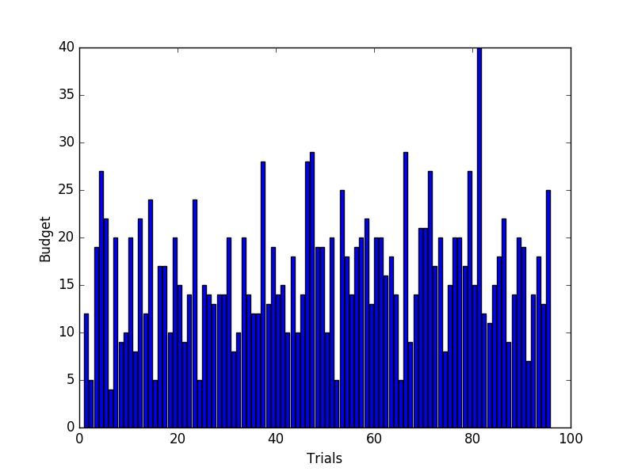

# Project 4: Reinforcement Learning

## Train a Smartcab How to Drive

Reinforcement Learning Project for Udacity's Machine Learning Nanodegree.

### Install

This project requires **Python 2.7** with the [pygame](https://www.pygame.org/wiki/GettingStarted
) library installed.

### Code

Template code is provided in the `smartcab/agent.py` python file. Additional supporting python code can be found in `smartcab/enviroment.py`, `smartcab/planner.py`, and `smartcab/simulator.py`. Supporting images for the graphical user interface can be found in the `images` folder. While some code has already been implemented to get you started, you will need to implement additional functionality for the `LearningAgent` class in `agent.py` when requested to successfully complete the project.

### Run

In a terminal or command window, navigate to the top-level project directory `smartcab/` (that contains this README) and run one of the following commands:

```
python smartcab/agent.py
python -m smartcab.agent
```

This will run the `agent.py` file and execute your agent code.


## Implement a Basic Driving Agent

>To begin, your only task is to get the smartcab to move around in the environment. At this point, you will not be concerned with any sort of optimal driving policy. Note that the driving agent is given the following information at each intersection:

>The next waypoint location relative to its current location and heading.
The state of the traffic light at the intersection and the presence of oncoming vehicles from other directions.
The current time left from the allotted deadline.
To complete this task, simply have your driving agent choose a random action from the set of possible actions (None, 'forward', 'left', 'right') at each intersection, disregarding the input information above. Set the simulation deadline enforcement, enforce_deadline to False and observe how it performs.

>QUESTION: Observe what you see with the agent's behavior as it takes random actions. Does the smartcab eventually make it to the destination? Are there any other interesting observations to note?

I have decided to implement a basic driving agent. It learns over time which
actions lead to a positive reward and do not take any actions that have been
observed to give negative rewards:

```Python
# TODO: Learn policy based on state, action, reward
if reward >= 0:
    self.valid_actions[self.state] = list(set(self.valid_actions.get(self.state, []) + [action]))
    self.posreward += 1.0
else:
    self.negreward += 1.0
```

and

```Python
action = self.policy(self.state)
```

To test the basic agent, I have executed it 100 times (trials). In terms
of performance metric, I use the the speed with which the cab can deliver
its passenger to its destination as well as the ration of actions that
give negative and positive rewards.

The results are not very encouraging: most of the times the agent does not
reach the final destination. The statistics:
- Overall, 2% of the actions gave a negative reward
- Overall, 98% of the actions gave a positive reward
- Only reached the destination in 2% of the trials

This means that the smartcab takes a defensive drive, but at the cost of not
getting to the final destination often.


I have decided to compare this results with an even more naive approach: at
any given point, the smartcab would take one of the any valid inputs.

```Python
action = self.policy(self.state, True)
```

The statistics for this version are not very encouraging:
- Overall, 55% of the actions gave a negative reward
- Overall, 45% of the actions gave a positive reward
- Only reached the destination in 19% of the trials

This means that the smartcab needs more time to reach the final destination.
However, a concerning factor is the fact that it takes risky actions, which
is undesirable in this domain (e.g., accidents may occur)

### Inform the Driving Agent

> QUESTION: What states have you identified that are appropriate for modeling the smartcab and environment? Why do you believe each of these states to be appropriate for this problem? Please discuss the included states and the omitted ones as well.

Having in mind that at each intersection is a traffic light that either allows
traffic in the North-South direction or the East-West direction and that the
U.S. Right-of-Way rules apply

- On a green light, a left turn is permitted if there is no oncoming traffic
making a right turn or coming straight through the intersection.
- On a red light, a right turn is permitted if no oncoming traffic is approaching
from your left through the intersection.

I think that the following variables are necessary and sufficient to model
state: `next_waypoint`, `light`, `oncoming`, and `left`. `Right` is not necessary because
it is always possible to turn right, except if there is `oncoming` traffic from
the `left` and the light is red, and that can be captured with the other state
variables.

>OPTIONAL: How many states in total exist for the smartcab in this environment? Does this number seem reasonable given that the goal of Q-Learning is to learn and make informed decisions about each state? Why or why not?

Given that there are 4 possibilities for `next_waypoint`, 2 possible values for
`left`, `light`, and `oncoming`, there are 32 (4x2x2x2) states. It seems
reasonable, i.e., it is possible to learn the best actions for a given state in
a reasonable amount of time, to learn the 32 possibilities and therefore make
informed decisions. 

## Implement a Q-Learning Driving Agent

> Your final task for this project is to enhance your driving agent so that, after sufficient training, the smartcab is able to reach the destination within the allotted time safely and efficiently. Parameters in the Q-Learning algorithm, such as the learning rate (alpha), the discount factor (gamma) and the exploration rate (epsilon) all contribute to the driving agent’s ability to learn the best action for each state. To improve on the success of your smartcab:

> Set the number of trials, n_trials, in the simulation to 100.
Run the simulation with the deadline enforcement enforce_deadline set to True (you will need to reduce the update delay update_delay and set the display to False).
Observe the driving agent’s learning and smartcab’s success rate, particularly during the later trials.
Adjust one or several of the above parameters and iterate this process.
This task is complete once you have arrived at what you determine is the best combination of parameters required for your driving agent to learn successfully.

> QUESTION: Report the different values for the parameters tuned in your basic implementation of Q-Learning. For which set of parameters does the agent perform best? How well does the final driving agent perform?

> QUESTION: Does your agent get close to finding an optimal policy, i.e. reach the destination in the minimum possible time, and not incur any penalties? How would you describe an optimal policy for this problem?

Toggling between the simple Learning and the Q-Learning driving Agent is done
by setting the following variable to False/True respectively:

```python
qlearner = True
```

I tuned the Q-Learner to use the following parameters:

```python
alpha = 0.5
gamma = 0.2
epsilon = 0.05
```

The statistics using these parameters are:

The statistics for this version are not very encouraging:
- Overall, 7% of the actions gave a negative reward
- Overall, 93% of the actions gave a positive reward
- The smartcab reached the destination, within the time limit, in 87% of the trials.
The budget it took to finish is plotted below:


